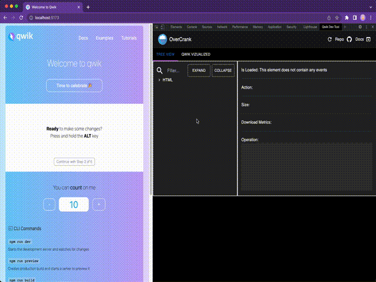
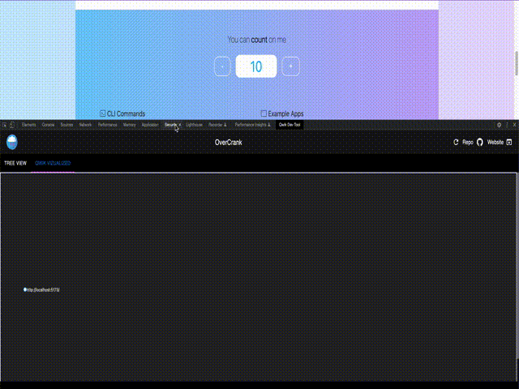

# OverCrank

<br>
    <div align="center">
        <a href='https://www.overcrank.dev/'>
            
        </a>
    </div>
<br>

### A Chrome Development Extension for Qwik Developers

OverCrank is a Chome extension designed to display and visualize the inner workings of the [Qwik Web Framework](https://qwik.builder.io/docs/think-qwik/). This is done by capturing the lazy loaded network requests and interpreting the resumability model which is embedded within the HTML of all Qwik websites.



<br>



## Contents

- [Motivations](#motivations)
- [Installaton](#installation)
- [Usage](#usage)
- [Contribute](#contribute)
- [Qwik Community](#community)
- [About Us](#about)

## Motiviations

Qwik is blazing fast thanks to removing the need for hydrations and instead utilizing a technique called [Resumability](https://qwik.builder.io/docs/concepts/resumable/) and utilizes a schema similar to that of React, Vue, or Svelte to design websites. For the developer, the complexity of the execution model is hidden away from the user which simplifies the development process; however, this abstraction hinders adoption of the platform as it is difficult to truly understand and appreciate the concepts occuring under the hood as well as the speed up in proformance compared to other other frameworks. In short, this tool is designed to help aspiring Qwik developers understand the complex interaction occuring when a lazy loaded component is loaded and to debug complex asynchronous interaction that can occur during app development.

## Installation

At the time of writing, OverCrank only support Chromium browsers.

### Easy Install

OverCrank can be found in the [Chrome WebStore](https://chrome.google.com/webstore/detail/overcrank/liieapoeenabnghbiimfeffghlaiallg?hl=en). Simply select "Add to Chrome" to add the tool to your browser.

Simply click Add to Chrome to add the tool to your browser.

### Manual Install

Clone the Git repo, install the dependencies, and build the extension.

```bash
$ git clone https://github.com/oslabs-beta/OverCrank.git
$ cd OverCrank/qwik-dev-tool
$ npm install
$ npm run build
```

Inside your browser navagate to `chrome://extensions/` and select `Load unpacked`. Using the file browser select the `extension` folder located within this directory at `qwik-dev-tool/src/extension`. If successful, OverCrank will appear as an installed extension.

## Usage

OverCrank targets Qwik development websites built in development mode using the standard `npm run dev` build flow. Instructions for getting a Qwik page up and running to test can be found at the [Getting Started Qwikly page](https://qwik.builder.io/docs/getting-started/)

### Access

The OverCrank Tool can be found inside the developer console any Chromium browser. To open the developer console, open the menu in the upper-right-hand corner of the browser window and select More Tools > Developer Tools. An alternative approach is to use Option + ⌘ + J (on macOS), or Shift + CTRL + J (on Windows/Linux). Inside the developer console, select the OverCrank to view the interface.

### Inspection

Upon loading of a Qwik developement website, OverCrank parses the HTML to identify Qwik components and indicates when data has been fetched according to Chrome fetch data. When any item within the hierarchical representation of the tree view of the current page is selected the panel on the right will display any Qwik relevant data. Once the component is loaded, the panel will display the deserialized information as well as other relevant details.

## Contribute

Contributions are always welcomed as Qwik is a rapidly evolving technology that is still subject to change. If you have feature requests or bugs to report, please use the Github Issues page and writeup your request. To submit code changes, please follow these steps to get your work merged into the repo:

1. Clone the repo and make a new branch: `$ git checkout https://github.com/oslabs-beta/OverCrank.git -b [name_of_new_branch]`
2. Add a feature,fix a bug, or refactor code
3. Write or update tests for the changes you made, if necessary
4. Open a Pull Request targetting the `dev` branch with a comprehensive description of changes

Thank you in advance for contributing!

## Community

The Qwik Community is growing and always looking for those interested in taking the plunge to work with the latest technology. To find out more about Qwik, feel free to reach out to the community on a number of different platforms which can be found [here](https://qwikcommunity.com/).

## About Us

More details about the team can be found on the [OverCrank website](https://www.overcrank.dev/)
